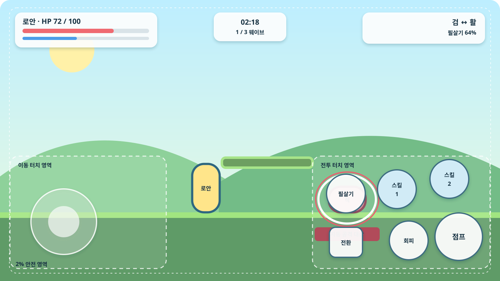

# 전투 프로토타입 명세 v0.1

| 항목 | 기준 |
|---|---|
| 대상 | Android 스마트폰 가로 화면 |
| 플레이 분량 | 1개 스테이지, 약 3분 |
| 검증 무기 | 검 / 활 |
| 조작 | 이동, 점프, 회피, 무기 전환, 무기별 스킬 2개, 필살기 |
| 자동화 | 바라보는 방향의 가장 가까운 적을 기본 공격 |
| 목표 성능 | 전투 중 60 FPS, 저사양 기기는 30 FPS 선택 가능 |

이 문서는 전체 게임을 만들기 전에 손맛과 화면 가독성만 검증하는 첫 설치 버전의 제작 기준이다. 아래 수치는 완성 수치가 아니라 플레이 테스트를 시작하기 위한 초기 가설이다.

## 1. 검증할 질문

1. 기본 공격이 자동이어도 위치 선정과 방향 전환이 능동적으로 느껴지는가?
2. 오른손으로 점프, 회피, 스킬, 무기 전환을 혼동 없이 사용할 수 있는가?
3. 검과 활을 바꾸는 이유가 3분 안에 자연스럽게 드러나는가?
4. 공중 대시와 가변 점프가 작은 화면에서도 정확하게 작동하는가?
5. 전진과 웨이브 전투가 번갈아 등장할 때 흐름이 끊기지 않는가?

직업, 레벨업 카드, 드롭 장비, 영구 성장, 이야기 연출은 이번 버전에 넣지 않는다. 전투 검증을 방해하지 않도록 체력과 필살기 게이지는 정해진 규칙으로만 변한다. 단, 모바일 조작 검증에 직접 필요한 **버튼 배치 편집 기능**은 프로토타입에 포함한다.

## 2. 화면과 터치 배치

기준 화면은 16:9 가로 화면이며, 모든 위치는 실제 픽셀이 아니라 화면 비율로 배치한다. 노치와 둥근 모서리를 피해 화면 가장자리 2퍼센트를 안전 영역으로 둔다.

| 요소 | 기준 위치 | 최소 터치 크기 | 규칙 |
|---|---:|---:|---|
| 이동 패드 | 좌측 하단, 화면의 약 32퍼센트 영역 | 손잡이 72 dp | 영역 안 첫 터치 지점에 중심이 생기는 동적 패드 |
| 점프 | 우측 하단 | 84 dp | 가장 크고 가장 바깥쪽에 배치 |
| 회피 | 점프 왼쪽 | 72 dp | 지상 회피와 공중 대시를 같은 버튼으로 처리 |
| 스킬 1 | 우측 중앙 아래 | 72 dp | 현재 무기의 첫 번째 스킬과 재사용 대기시간 표시 |
| 스킬 2 | 스킬 1 오른쪽 위 | 72 dp | 현재 무기의 두 번째 스킬과 재사용 대기시간 표시 |
| 필살기 | 스킬 1 왼쪽 | 72 dp | 충전 전에는 반투명, 충전 후 강조 |
| 무기 전환 | 필살기 아래 | 64 dp | 현재 무기와 보조 무기 아이콘을 동시에 표시 |

멀티터치를 지원해 이동 중 점프, 회피 또는 스킬 사용이 가능해야 한다. 버튼 크기, 위치와 불투명도는 설정의 `조작 배치` 화면에서 사용자가 직접 변경할 수 있다.

### 조작 배치 편집

| 기능 | 프로토타입 기준 |
|---|---|
| 진입 | 타이틀 또는 일시정지 메뉴의 `설정 → 조작 배치` |
| 위치 변경 | 이동 패드 영역과 각 액션 버튼을 드래그 |
| 크기 변경 | 선택한 요소의 크기 슬라이더, 기본값의 70–140퍼센트 |
| 불투명도 | 전체 조작 UI 공통 슬라이더, 30–100퍼센트 |
| 프리셋 | 기본, 왼손잡이, 사용자 설정 |
| 테스트 | 편집 화면에서 캐릭터를 움직이는 10초 테스트 모드 |
| 저장 | `적용`을 눌렀을 때만 기기 내부에 저장 |
| 취소 | 진입 전 배치로 복원하고 종료 |
| 초기화 | 선택한 프리셋의 기본 배치로 복원 |

좌표는 0에서 1 사이의 화면 비율로 저장해 해상도가 달라도 같은 상대 위치를 유지한다. 버튼 중심은 안전 영역 밖으로 나갈 수 없다. 두 터치 영역이 30퍼센트 이상 겹치면 경고를 표시하고 적용을 막는다. 점프 버튼은 최소 64 dp, 나머지 액션 버튼은 최소 56 dp의 실제 터치 영역을 보장한다. 이동 패드와 액션 버튼의 화면 좌우를 바꿀 수 있도록 왼손잡이 프리셋을 제공한다.

편집 중에는 선택한 버튼의 실제 터치 영역, 안전 영역과 다른 버튼과의 겹침을 표시한다. 장식 아이콘과 터치 판정 영역은 분리해, 불투명도를 낮춰도 입력 판정에는 영향을 주지 않는다.

### HUD

- 좌측 상단: 캐릭터 이름, 체력, 경험치 자리 표시자
- 중앙 상단: 남은 시간과 현재 구간
- 우측 상단: 주·보조 무기, 필살기 게이지, 직업 성향 자리 표시자
- 적 머리 위: 체력과 상태 이상만 표시하고 일반 적 이름은 생략
- 자동 공격 대상: 흰색 외곽선과 작은 표식으로 표시

## 3. 입력과 이동

| 항목 | 초기값 | 의도 |
|---|---:|---|
| 지상 이동 속도 | 5.5 m/s | 작은 화면에서도 즉시 반응하되 미끄럽지 않게 함 |
| 지상 가속도 | 40 m/s² | 패드를 놓았을 때 빠르게 정지 |
| 최대 점프 높이 | 약 2.2 m | 기본 발판 한 층을 여유 있게 통과 |
| 점프 입력 버퍼 | 0.12초 | 착지 직전 입력을 허용 |
| 코요테 타임 | 0.10초 | 발판 끝에서 늦은 점프를 허용 |
| 회피 무적 | 0.18초 | 공격을 읽고 피했을 때 명확한 보상 제공 |
| 무기 전환 제한 | 0.50초 | 빠른 전환은 허용하되 연타 악용 방지 |
| 낙하 피해 | 최대 체력의 10퍼센트 | 즉사 대신 마지막 안전 발판으로 복귀 |

점프 버튼을 짧게 누르면 낮게, 길게 누르면 최대 높이까지 올라간다. 공중에서 회피하면 입력 방향으로 대시하며 착지할 때까지 다시 사용할 수 없다. 방향 입력이 없다면 캐릭터가 바라보는 방향으로 대시한다.

## 4. 자동 기본 공격

1. 캐릭터가 바라보는 반원 안에서 공격 가능한 적을 찾는다.
2. 가장 가까운 적을 고르되, 현재 대상이 유효하면 거리 차이가 20퍼센트 이상 벌어질 때만 바꾼다.
3. 0.10초마다 대상을 다시 확인한다.
4. 대상이 죽거나 사거리에서 벗어나면 즉시 다음 적을 찾는다.
5. 활은 화면 밖의 적을 대상으로 삼지 않는다.
6. 대상이 없으면 공격 애니메이션을 재생하지 않는다.

대상 유지 조건을 두는 이유는 가까운 적 둘 사이에서 표식과 캐릭터 방향이 빠르게 흔들리는 현상을 막기 위해서다. 자동 공격은 이동, 점프, 회피를 취소하지 않으며 스킬과 회피 입력이 기본 공격보다 우선한다.

## 5. 초기 전투 수치

### 플레이어

| 항목 | 값 |
|---|---:|
| 최대 체력 | 100 |
| 피격 후 무적 | 0.50초 |
| 필살기 필요 게이지 | 100 |
| 기본 공격 적중 시 게이지 | 4 |
| 스킬 적중 시 게이지 | 8 |
| 정확한 회피 시 게이지 | 12 |

### 검

| 행동 | 피해 / 효과 | 재사용 대기시간 |
|---|---|---:|
| 기본 3연격 | 12 → 14 → 20, 사거리 1.6 m | 타격 간 0.28 / 0.30 / 0.42초 |
| 스킬 1: 돌진 베기 | 전방 3.5 m 이동, 피해 35 | 6초 |
| 스킬 2: 회전 베기 | 주변에 피해 20 × 2 | 9초 |

검은 가까운 적을 빠르게 정리하고 돌진형 정예의 빈틈을 파고드는 무기다. 기본 공격의 세 번째 타격은 약한 적을 경직시킨다.

### 활

| 행동 | 피해 / 효과 | 재사용 대기시간 |
|---|---|---:|
| 기본 사격 | 피해 14, 사거리 8 m, 탄속 14 m/s | 0.75초 |
| 스킬 1: 관통 화살 | 피해 36, 최대 3개체 관통 | 7초 |
| 스킬 2: 화살비 | 범위 내 적마다 피해 8 × 6, 한 대상 최대 48 | 11초 |

활은 접근하기 어려운 적과 공중 적을 처리하는 무기다. 적이 검 사거리 안으로 들어오면 활의 기본 공격 피해가 20퍼센트 감소해 무기 전환을 유도한다.

### 공용 필살기: 새벽의 틈

3초 동안 적과 적 투사체의 시간이 정상 속도의 15퍼센트로 느려진다. 플레이어와 플레이어 투사체는 정상 속도로 움직인다. 시전 중 무적은 없으며, 한 스테이지에서 평균 한 번 사용할 수 있도록 게이지 획득량을 조정한다.

### 적

| 적 | 체력 | 공격 | 역할 |
|---|---:|---:|---|
| 풀잎 슬라임 | 36 | 접촉 8 | 낮은 점프로 넘거나 검으로 빠르게 처리 |
| 씨앗 포대 | 30 | 씨앗탄 7 | 활 사용과 투사체 회피 유도 |
| 바람 정령 | 24 | 돌진 10 | 공중 표적과 방향 전환 연습 |
| 갑옷 멧돼지 정예 | 600 | 돌진 16, 충격파 12 | 무기 전환과 회피를 함께 검사 |

## 6. 3분 스테이지 구성

배경은 바람꽃 평원의 낮 시간대로 고정한다. 첫 실행만 짧은 조작 표식을 보여주고 두 번째 실행부터는 표시하지 않는다.

| 시간 | 구간 | 배치와 의도 |
|---|---|---|
| 0:00–0:40 | 전진 1 | 풀잎 슬라임 2마리, 낮은 발판 3개. 이동·가변 점프·검 자동 공격 학습 |
| 0:40–1:15 | 웨이브 1 | 슬라임 3마리와 씨앗 포대 1마리. 근거리와 원거리 위협 구분 |
| 1:15–1:50 | 전진 2 | 낙하 구간, 공중 발판, 바람 정령 2마리. 활과 공중 대시 사용 유도 |
| 1:50–2:30 | 웨이브 2 | 씨앗 포대 2마리, 바람 정령 2마리, 슬라임 2마리. 무기 전환 검사 |
| 2:30–3:00 | 정예 전투 | 갑옷 멧돼지 정예 1마리. 돌진 회피 후 검, 충격파 준비 중 활 사용 |

진행이 늦어도 제한 시간이 끝나면 실패시키지 않는다. 3분은 목표 시간이며 4분을 넘기면 결과 화면에 지연된 구간을 표시한다.

## 7. 적 행동 요약

### 풀잎 슬라임

- 평소에는 좌우로 짧게 이동한다.
- 플레이어가 3 m 안에 들어오면 0.35초 준비 후 점프한다.
- 착지 후 0.8초 동안 공격하지 않아 반격 시간을 준다.

### 씨앗 포대

- 플레이어와 4–7 m 거리를 유지한다.
- 1.0초 조준 표시 후 씨앗탄 3발을 부채꼴로 발사한다.
- 근접 공격을 받으면 뒤로 밀려나며 1초 동안 사격하지 않는다.

### 바람 정령

- 플레이어 머리 높이 근처를 유지한다.
- 흰색 직선 경고를 0.6초 표시한 뒤 돌진한다.
- 벽에 닿거나 빗나가면 1.2초 동안 멈춘다.

### 갑옷 멧돼지 정예

- 0.8초 경고 후 화면 절반을 가로지르는 돌진을 사용한다.
- 돌진이 벽에 닿으면 1.5초간 기절하고 검 피해를 25퍼센트 더 받는다.
- 체력이 50퍼센트 아래면 충격파를 준비하며, 준비 중에는 활 피해를 25퍼센트 더 받는다.
- 같은 패턴을 연속으로 세 번 사용하지 않는다.

## 8. 피드백과 가독성

- 기본 타격 정지: 검 0.04초, 강한 타격과 정예 약점 공격 0.07초
- 피격 시 캐릭터 점멸: 0.12초, 화면 전체의 흰색 섬광은 사용하지 않음
- 위험 공격 경고: 적색 계열과 도형을 함께 사용해 색에만 의존하지 않음
- 재사용 대기시간: 아이콘을 가리는 원형 마스크와 남은 초를 함께 표시
- 무기 전환: 아이콘 위치 교환, 짧은 소리, 캐릭터 손의 무기 실루엣 변경
- 진동: 강한 타격, 정확한 회피, 필살기에만 사용하며 설정에서 끌 수 있음

## 9. 기술 기준

첫 프로토타입 엔진은 **Godot 4.x**를 우선 후보로 한다. 무료·오픈소스이며 2D 제작과 Android 오프라인 빌드에 필요한 기능이 충분하고, 수익 없는 프로젝트의 운영 부담이 작다. 실제 구현 직전에 빈 프로젝트의 Android 설치와 입력 지연을 확인한 뒤 확정한다.

| 항목 | 기준 |
|---|---|
| 화면 방향 | 가로 고정 |
| 기준 해상도 | 1920 × 1080, 비율 기반 확대·축소 |
| 프레임 | 60 FPS 목표, 30 FPS에서도 게임 속도 동일 |
| 물리 갱신 | 고정 시간 간격 |
| 저장 | 설정과 최고 기록만 기기 내부 JSON으로 저장 |
| 네트워크 | 사용하지 않음 |
| 테스트 기록 | 시간, 사망 위치, 피격 원인, 무기 사용 시간, 스킬 사용 횟수를 로컬 JSON으로 저장 |

Google Play 제출용 Android API 수준과 패키징 규칙은 출시 시점의 요구사항에 맞춘다. 첫 프로토타입에서는 실제 기기에 설치되는 디버그 APK 생성까지만 검증한다.

## 10. 완료 조건

### 기능 완료

- 시작부터 결과 화면까지 한 번의 플레이가 중단 없이 가능하다.
- 이동하면서 다른 손으로 모든 액션을 동시에 사용할 수 있다.
- 검과 활의 기본 공격, 각 스킬 2개, 필살기와 전환이 작동한다.
- 대상 선택이 표시되고 바라보는 방향 밖의 적을 공격하지 않는다.
- 공중 대시는 공중에서 한 번만 사용되며 착지 시 복구된다.
- Android 실제 기기에서 오프라인으로 실행된다.
- 설정에서 버튼 위치·크기·불투명도를 변경하고 재실행 후에도 유지된다.
- 기본 및 왼손잡이 프리셋 전환, 취소와 초기화가 의도대로 동작한다.

### 플레이 테스트 통과 기준

5명 이상에게 조작 설명 없이 첫 1분을 플레이하게 하고 아래를 확인한다.

| 지표 | 통과 기준 |
|---|---:|
| 10초 안에 이동과 점프 성공 | 80퍼센트 이상 |
| 90초 안에 무기 전환을 자발적으로 사용 | 60퍼센트 이상 |
| 의도하지 않은 자동 공격 대상이 1.5초 이상 유지된 횟수 | 1회 이하 |
| 액션 버튼을 보기 위해 손을 멈춘 횟수 | 3회 이하 |
| 평균 클리어 시간 | 2분 40초–3분 40초 |
| 다시 플레이 의향 | 60퍼센트 이상 |

통과하지 못한 항목은 콘텐츠를 늘리기 전에 조작 배치, 적 패턴 또는 수치를 수정한다.

## 11. 제작 순서

1. 회색 박스 맵과 이동·점프·낙하 복귀 구현
2. 자동 대상 선택과 검 기본 공격 구현
3. 활, 무기 전환과 대상 표시 구현
4. 회피·공중 대시와 세 종류 일반 적 구현
5. 무기별 스킬과 공용 필살기 구현
6. 조작 배치 편집 화면과 기기 저장 구현
7. 정예 전투, HUD, 효과음과 진동 추가
8. 실제 Android 기기 테스트와 수치 조정

입력 상태도와 전투 데이터 스키마는 [입력 및 데이터 설계](INPUT_AND_DATA_DESIGN.md), 구현 순서와 완료 기준은 [구현 작업 목록](IMPLEMENTATION_BACKLOG.md)을 따른다.
