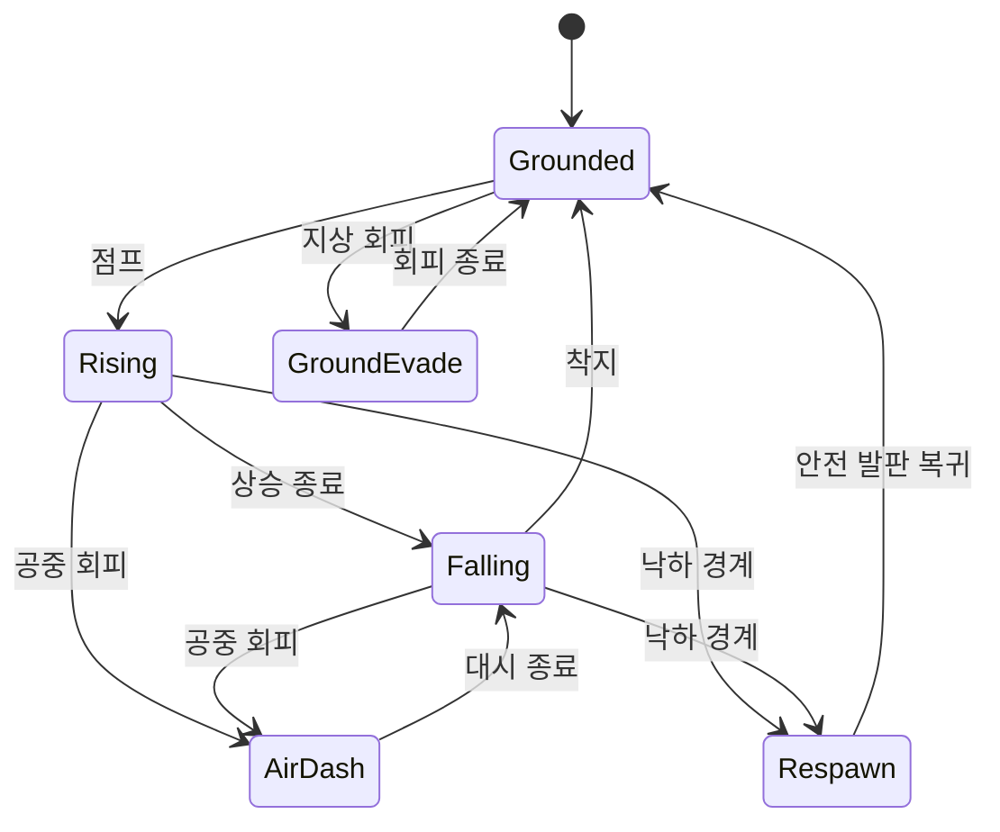
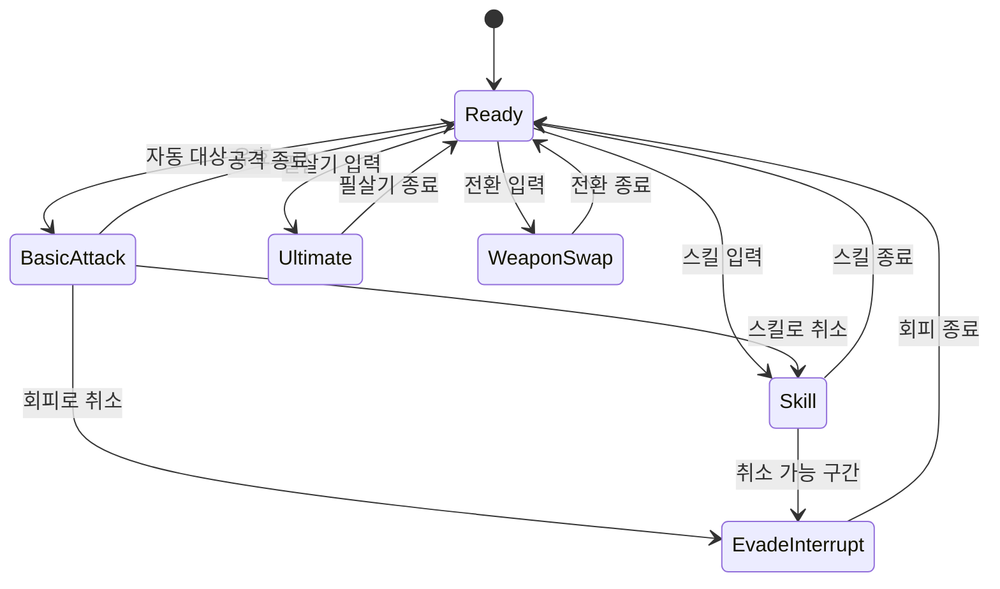
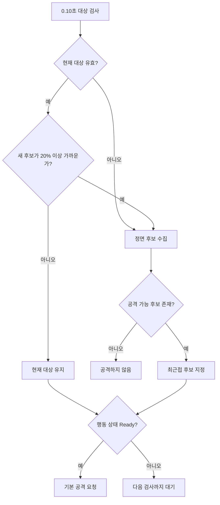

# 입력 및 데이터 설계 v0.1

이 문서는 첫 전투 프로토타입의 입력 처리, 플레이어 상태 전이와 데이터 저장 경계를 정의한다. 엔진 코드보다 먼저 규칙을 고정해 입력 누락과 상태 충돌을 줄이는 것이 목적이다.

## 1. 입력 처리 원칙

- 화면의 각 터치를 고유 포인터 ID로 추적한다.
- 이동 패드를 잡은 손가락과 액션 버튼을 누른 손가락을 별도로 처리한다.
- 한 손가락이 이동 패드 영역에서 시작하면 손을 떼기 전까지 액션 버튼으로 넘어가지 않는다.
- 버튼은 `누르기`, `누르고 있기`, `떼기` 이벤트를 구분한다.
- 점프 높이는 누르고 있는 시간에 따라 달라지고 나머지 액션은 누르는 순간 실행 요청을 만든다.
- UI는 명령을 직접 실행하지 않고 `PlayerCommand`를 생성한다. 캐릭터 상태가 명령 실행 가능 여부를 판정한다.
- 자동 기본 공격은 사용자 입력이 아니라 전투 시스템이 생성하는 낮은 우선순위 명령으로 취급한다.

## 2. 명령 우선순위

같은 프레임에 여러 명령이 들어오면 아래 순서로 판정한다.

| 순위 | 명령 | 처리 |
|---:|---|---|
| 1 | 사망·컷신·일시정지 | 모든 전투 명령 차단 |
| 2 | 회피 / 공중 대시 | 기본 공격과 이동 공격을 취소 가능 |
| 3 | 필살기 | 일반 스킬과 기본 공격보다 우선 |
| 4 | 액티브 스킬 | 기본 공격을 취소 가능, 다른 스킬은 취소하지 않음 |
| 5 | 점프 | 이동과 병행, 일부 스킬 중에는 대기열에 저장 |
| 6 | 무기 전환 | 공격 동작이 끝난 뒤 실행, 회피 중에는 예약 |
| 7 | 자동 기본 공격 | 다른 행동이 없을 때만 실행 |
| 8 | 이동 | 대부분의 행동과 병행하되 강한 경직 중에는 무시 |

점프와 무기 전환 예약은 각각 하나만 보관하며 유효 시간은 0.12초와 0.20초다. 오래된 요청은 실행하지 않고 폐기한다.

## 3. 플레이어 상태도

이동 상태와 전투 행동 상태는 서로 분리한다. 예를 들어 공중에서 활을 쏘거나 지상 이동 중 스킬을 사용할 수 있다.





`Skill` 상태는 스킬 데이터의 `can_move`, `can_turn`, `evade_cancel_start` 값을 따른다. 필살기는 시간 감속 효과만 발동하고 플레이어를 무적으로 만들지 않는다.

## 4. 자동 공격 판정 흐름



거리 비교는 캐릭터 중심이 아니라 공격 시작점과 적의 가장 가까운 피격점 사이의 거리로 계산한다. 활 후보는 카메라 가시 영역 안에 있어야 한다.

## 5. 조작 배치 데이터

조작 배치는 앱 설정 파일에 저장한다. 좌표와 크기는 화면에 독립적인 값으로 유지하고 실행 시 안전 영역과 dp 크기로 변환한다.

```json
{
  "schema_version": 1,
  "active_preset": "custom",
  "global_opacity": 0.82,
  "controls": [
    { "id": "move_zone", "x": 0.17, "y": 0.78, "scale": 1.00 },
    { "id": "jump", "x": 0.92, "y": 0.82, "scale": 1.00 },
    { "id": "evade", "x": 0.82, "y": 0.83, "scale": 1.00 },
    { "id": "skill_1", "x": 0.79, "y": 0.66, "scale": 1.00 },
    { "id": "skill_2", "x": 0.90, "y": 0.61, "scale": 1.00 },
    { "id": "ultimate", "x": 0.69, "y": 0.68, "scale": 1.00 },
    { "id": "weapon_swap", "x": 0.69, "y": 0.84, "scale": 1.00 }
  ]
}
```

| 필드 | 범위 | 설명 |
|---|---|---|
| `schema_version` | 1 이상 정수 | 향후 저장 형식 변경 시 마이그레이션 판단 |
| `active_preset` | `default`, `left_handed`, `custom` | 현재 사용 중인 프리셋 |
| `global_opacity` | 0.30–1.00 | 조작 UI의 시각적 불투명도 |
| `id` | 고정 문자열 | 조작 요소 식별자 |
| `x`, `y` | 0.00–1.00 | 안전 영역 내부의 정규화된 중심 좌표 |
| `scale` | 0.70–1.40 | 기본 크기에 대한 배율 |

저장할 때 알 수 없는 ID는 제거하지 않고 별도 보관해 이전 버전으로 되돌렸을 때 사용자 설정이 사라지지 않게 한다. 필수 ID가 없거나 값이 범위를 벗어나면 해당 요소만 현재 버전 기본값으로 복구한다.

## 6. 런타임 전투 데이터

무기, 스킬, 적과 스테이지 구성은 코드에 직접 수치를 넣지 않고 리소스 데이터로 분리한다. 프로토타입에서는 편집기 리소스를 사용하되 필드 이름은 아래와 같이 통일한다.

### 무기 정의

| 필드 | 형식 | 예시 | 설명 |
|---|---|---|---|
| `weapon_id` | 문자열 | `sword_basic` | 저장과 참조에 사용하는 고정 ID |
| `display_name` | 문자열 | `연습용 검` | 화면 표시명 |
| `attack_range_m` | 실수 | `1.6` | 자동 공격 최대 거리 |
| `attack_interval_s` | 실수 배열 | `[0.28, 0.30, 0.42]` | 연속 공격 간격 |
| `damage` | 정수 배열 | `[12, 14, 20]` | 각 연속 공격 피해 |
| `projectile_speed_mps` | 실수 | `0` | 근접 무기는 0 |
| `skill_ids` | 문자열 배열 | `[...]` | 장착되는 스킬 두 개 |

### 스킬 정의

| 필드 | 형식 | 설명 |
|---|---|---|
| `skill_id` | 문자열 | 고정 ID |
| `cooldown_s` | 실수 | 재사용 대기시간 |
| `damage_events` | 배열 | 타격 시점, 피해와 범위 목록 |
| `can_move` | 불리언 | 사용 중 이동 허용 여부 |
| `can_turn` | 불리언 | 사용 중 방향 변경 허용 여부 |
| `evade_cancel_start_s` | 실수 또는 null | 이 시점 이후 회피 취소 허용 |
| `ultimate_gain` | 정수 | 적중 시 필살기 게이지 |

### 적 정의

| 필드 | 형식 | 설명 |
|---|---|---|
| `enemy_id` | 문자열 | 고정 ID |
| `max_hp` | 정수 | 최대 체력 |
| `contact_damage` | 정수 | 접촉 또는 기본 공격 피해 |
| `move_speed_mps` | 실수 | 기본 이동 속도 |
| `behavior_id` | 문자열 | 사용할 행동 트리 또는 상태 머신 |
| `stagger_resistance` | 실수 | 경직 저항값 |
| `weakness_tags` | 문자열 배열 | 정예 약점과 무기 보정 태그 |

### 스테이지 구간 정의

```json
{
  "stage_id": "prototype_windflower_01",
  "target_duration_s": 180,
  "segments": [
    { "id": "advance_1", "start_s": 0, "type": "advance" },
    { "id": "wave_1", "start_s": 40, "type": "wave", "gate": true },
    { "id": "advance_2", "start_s": 75, "type": "advance" },
    { "id": "wave_2", "start_s": 110, "type": "wave", "gate": true },
    { "id": "elite", "start_s": 150, "type": "elite", "gate": true }
  ]
}
```

`start_s`는 강제 출현 시간이 아니라 목표 페이싱 기준이다. 플레이어가 이전 관문을 늦게 끝냈다면 다음 구간은 완료 직후 시작한다.

## 7. 로컬 테스트 기록

개인정보나 네트워크 식별자를 수집하지 않고 각 실행을 기기 내부 JSON Lines 파일로 기록한다.

| 이벤트 | 핵심 필드 |
|---|---|
| `run_started` | 실행 ID, 조작 프리셋, 화면 크기 |
| `segment_entered` | 구간 ID, 경과 시간, 현재 체력 |
| `damage_taken` | 적 ID, 패턴 ID, 피해, 위치 |
| `weapon_swapped` | 이전·이후 무기, 경과 시간 |
| `skill_used` | 스킬 ID, 적중 수, 경과 시간 |
| `player_fell` | 위치, 경과 시간 |
| `run_finished` | 성공 여부, 총시간, 남은 체력 |

실행 ID는 매 실행 생성한 임의 UUID이며 계정이나 기기 정보와 연결하지 않는다. 설정에서 테스트 기록을 초기화할 수 있게 한다.

## 8. 저장 책임 분리

| 파일 | 저장 시점 | 손상 시 처리 |
|---|---|---|
| `settings.json` | 설정 화면에서 적용 | 마지막 정상 사본 복구 후 기본값 사용 |
| `control_layout.json` | 조작 배치 적용 | 요소별 검증 후 잘못된 요소만 초기화 |
| `prototype_best.json` | 결과 화면 진입 | 최고 기록이 없으면 새로 생성 |
| `combat_events.jsonl` | 테스트 이벤트 발생 | 잘못된 마지막 줄을 무시하고 계속 기록 |

전투 도중에는 조작 배치를 저장하지 않는다. 일시정지 메뉴에서 편집 화면으로 이동할 경우 현재 스테이지를 유지하고, 적용 후 카운트다운 3초를 거쳐 전투로 돌아온다.
