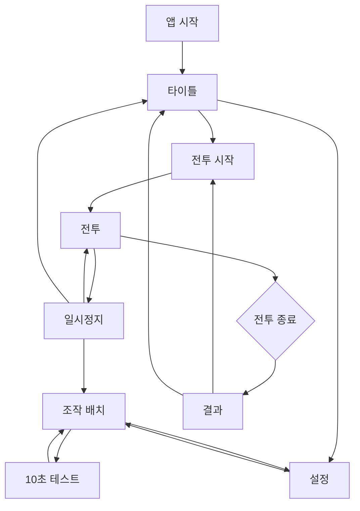
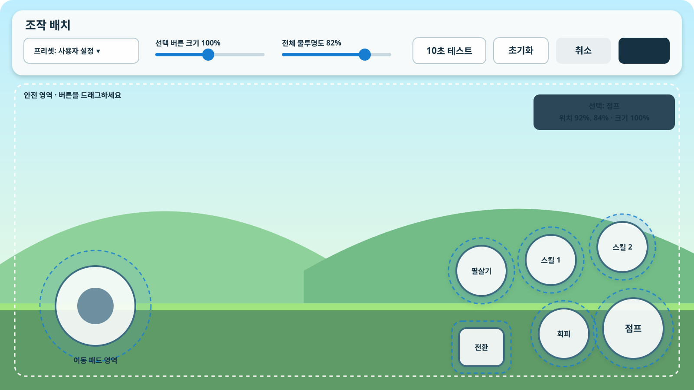

# 프로토타입 화면 흐름 및 UI 명세 v0.1

첫 전투 프로토타입에서 필요한 화면만 정의한다. 직업, 성장, 마을과 이야기 화면은 포함하지 않는다.

## 1. 화면 흐름

앱이 비정상 종료되거나 운영체제에 의해 제거된 경우 프로토타입에서는 진행 중 전투를 복구하지 않고 타이틀로 돌아간다. 조작 설정과 최고 기록은 유지한다.

## 2. 공통 원칙

- 가로 화면만 지원한다.
- 화면 가장자리 2퍼센트와 운영체제가 제공하는 디스플레이 컷아웃 영역을 안전 영역으로 사용한다.
- 중요한 조작은 아이콘만 표시하지 않고 짧은 텍스트 또는 접근성 이름을 함께 제공한다.
- 확인이 필요한 버튼은 한 화면에 하나만 강조한다.
- 전투로 돌아갈 때는 3초 카운트다운을 표시해 갑작스러운 피격을 막는다.
- 뒤로가기 동작은 현재 화면의 `취소` 또는 `일시정지`와 동일하게 처리한다.

## 3. 타이틀 화면

### 구성

| 위치 | 요소 | 동작 |
|---|---|---|
| 중앙 | `전투 시작` | 프로토타입 스테이지 시작 |
| 중앙 아래 | `설정` | 설정 화면으로 이동 |
| 우측 아래 | 버전 | 프로토타입 버전과 빌드 번호 표시 |
| 좌측 아래 | 최고 기록 | 가장 빠른 완료 시간과 최소 피격 횟수 표시 |

첫 실행 시 `전투 시작` 아래에 “기본 공격은 자동입니다. 이동과 스킬에 집중하세요.”를 한 번만 표시한다.

## 4. 설정 화면

| 항목 | 값 | 기본값 |
|---|---|---:|
| 효과음 | 0–100퍼센트 | 80퍼센트 |
| 진동 | 켜기 / 끄기 | 켜기 |
| 화면 흔들기 | 켜기 / 끄기 | 켜기 |
| 프레임 | 60 / 30 FPS | 60 FPS |
| 조작 UI 불투명도 | 30–100퍼센트 | 82퍼센트 |
| 조작 배치 | 편집 화면 진입 | 기본 프리셋 |
| 테스트 기록 | 초기화 | 확인 후 삭제 |

설정값은 변경 즉시 미리 적용하되 `적용`을 눌러야 저장한다. `취소`를 누르면 화면 진입 전 값으로 되돌린다.

## 5. 조작 배치 편집 화면

### 상단 도구 모음

| 요소 | 동작 |
|---|---|
| 프리셋 | 기본 / 왼손잡이 / 사용자 설정 선택 |
| 크기 | 현재 선택한 조작 요소를 70–140퍼센트로 조절 |
| 불투명도 | 모든 전투 조작 UI를 30–100퍼센트로 조절 |
| 테스트 | 현재 배치로 10초 테스트 시작 |
| 초기화 | 현재 프리셋의 기본 배치로 되돌림 |

### 편집 규칙

1. 버튼 또는 이동 영역을 누르면 선택 테두리와 실제 터치 판정 영역을 표시한다.
2. 선택한 요소를 드래그하면 중심 좌표가 이동한다.
3. 안전 영역에 닿으면 더 바깥으로 이동하지 않고 가장자리에 붙는다.
4. 다른 요소와 터치 영역이 30퍼센트 이상 겹치면 두 요소를 적색 사선으로 표시한다.
5. 겹침 오류가 있으면 `적용` 버튼을 비활성화하고 원인을 상단에 표시한다.
6. HUD 영역과 조작 영역이 겹치는 것은 허용하지만 기본 배치에서는 겹치지 않게 한다.
7. 편집 중 기기 해상도나 안전 영역이 바뀌면 좌표를 다시 제한하고 변경 사실을 알린다.

### 저장과 프리셋

- 기본 또는 왼손잡이 프리셋의 요소를 움직이는 순간 `사용자 설정`으로 전환한다.
- `적용`은 모든 값 검증 후 저장하고 이전 화면으로 돌아간다.
- `취소`는 편집 화면 진입 시점의 설정을 복구한다.
- `초기화`는 확인창 없이 배치만 되돌리며, 저장 전에는 `취소`로 원래 배치를 복구할 수 있다.
- 사용자 설정은 프로토타입에서 한 개만 저장한다.

## 6. 10초 조작 테스트

편집 화면 안의 테스트 공간을 전체 화면으로 확대한다. 적과 피해는 없으며 아래 항목을 확인한다.

- 이동 패드 방향과 세기
- 짧은 점프와 긴 점프
- 지상 회피와 공중 대시
- 스킬 두 개, 필살기와 무기 전환 버튼의 동시 입력
- 누른 버튼의 실제 터치 영역 강조

상단 중앙에 10초 카운트다운과 `테스트 종료` 버튼을 표시한다. 시간이 끝나거나 종료 버튼을 누르면 편집 화면으로 돌아가며 설정은 자동 저장하지 않는다.

## 7. 전투 HUD

| 영역 | 요소 | 표시 규칙 |
|---|---|---|
| 좌측 상단 | 체력 | 현재값 / 최대값, 위험 구간에서 색상과 흔들림을 함께 사용 |
| 좌측 상단 아래 | 경험치 자리 표시자 | 프로토타입에서는 비활성 상태로 유지 |
| 중앙 상단 | 경과 시간과 구간 | 목표 3분을 넘겨도 계속 증가 |
| 우측 상단 | 주·보조 무기 | 현재 무기를 크게, 보조 무기를 작게 표시 |
| 우측 상단 아래 | 필살기 | 숫자 퍼센트와 게이지 표시 |
| 적 주변 | 자동 대상 | 흰색 외곽선과 작은 삼각 표식 |

버튼 재사용 대기시간은 아이콘 위 원형 가림막과 남은 시간을 함께 표시한다. 1초 미만은 소수점 한 자리, 그 이상은 올림한 정수로 표시한다.

## 8. 일시정지

일시정지 중에는 게임 시간, 물리와 재사용 대기시간을 모두 멈춘다.

| 버튼 | 결과 |
|---|---|
| 계속 | 3초 카운트다운 후 전투 복귀 |
| 조작 배치 | 현재 전투를 유지한 채 편집 화면 진입 |
| 처음부터 | 확인 후 스테이지 재시작 |
| 타이틀로 | 확인 후 현재 전투 종료 |

조작 배치를 적용하고 돌아오면 새 배치를 즉시 사용한다. 취소하면 일시정지 전 배치를 유지한다.

## 9. 결과 화면

### 주요 결과

- 성공 또는 실패
- 완료 시간
- 남은 체력
- 받은 피해 횟수와 가장 많이 맞은 공격
- 검·활 사용 시간 비율
- 무기 전환 횟수
- 스킬·회피·공중 대시 사용 횟수
- 낙하 횟수

### 행동

`다시 시작`을 기본 강조 버튼으로 두고 `조작 배치`, `타이틀로`를 함께 제공한다. 최고 기록을 갱신한 항목은 한 번만 강조한다.

## 10. 화면별 뒤로가기

| 화면 | 뒤로가기 결과 |
|---|---|
| 타이틀 | 앱 종료 확인 |
| 설정 | 취소와 동일 |
| 조작 배치 | 변경 사항이 있으면 저장하지 않고 나갈지 확인 |
| 테스트 모드 | 즉시 편집 화면으로 복귀 |
| 전투 | 일시정지 |
| 일시정지 | 계속과 동일 |
| 결과 | 타이틀로 이동 |
